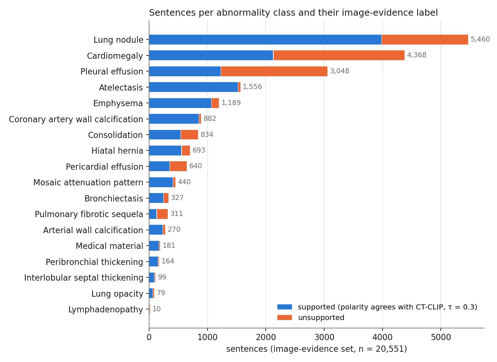

# CT-Report-PRM-Corpus: a sentence-level labelled corpus for volumetric CT report verification

**Anonymous release accompanying a submission under review.** Author details will be added after the review period.

This repository releases the first sentence-level labelled corpus for volumetric (3D) chest-CT report generation, together with the pipeline that produced it and the Best-of-N selection code that uses it. Every sentence was generated by CT-CHAT for one of the **same 5,000 CT-RATE training studies** and labelled twice, by two independent sources — but the two label sets do not cover identical *sentence* counts, because only sentences naming one of 18 CT-RATE abnormality classes can be checked against the image:

| Label source | Sentences | Studies | Supported | What "supported" means |
|---|---|---|---|---|
| **Image evidence** (CT-CLIP, τ = 0.3, used for the **0.5B** reward model) | 20,551 (from 4,955 of the 5,000 studies) | 4,955 | 66.6 % | the sentence's asserted polarity agrees with the thresholded CT-CLIP probability for the finding it names |
| Image evidence (CT-CLIP, τ = 0.4, used for the **3B** reward model) | 20,551 (from the same 4,955 studies) | 4,955 | 64.7 % | same rule, higher threshold |
| **LLM vs. reference report** (comparator, both 0.5B and 3B) | 81,452 (all 5,000 studies) | 5,000 | 70.2 % | an LLM finds no concrete contradiction between the sentence and the radiologist's reference report |

In short: **all 5,000 studies have an LLM label; 4,955 of them additionally have an image-evidence label** (the other 45 studies' generated sentences never name one of the 18 classes, so RadGraph maps none of them to a class). A reward model trained on either label set sees the same underlying reports, but the image-evidence model trains on a strict subset of sentences.


*(a) The frozen CT-CLIP encoder gives zero-shot probabilities for the 18 abnormality classes. (b) RadGraph parses each generated sentence into entities and their asserted polarity; entities are mapped to the 18 classes, and sentences without a disease entity are discarded. (c) Polarity and the class probability are combined at threshold τ into a binary support label. (d) One record per report trains a sentence-level reward model.*

## The corpus at a glance



Lung nodule, cardiomegaly and pleural effusion account for 63 % of the image-evidence set; lymphadenopathy (10 sentences) and lung opacity (79) are the rarest classes. The support rate also varies by class, from 40 % for pleural-effusion sentences to 98 % for atelectasis.


The two label sources are not interchangeable. On the same 20,551 sentences the image-evidence rule supports 88 % of sentences that *assert* a finding and 38 % of those that *deny* one, while the LLM-vs-reference rule does almost the reverse (26 % and 87 %). Overall agreement is 39.8 %. The reason is structural: reference reports rarely mention every normal structure, so a denial is almost never contradicted by the reference, whereas CT-CLIP scores an absence directly against the image. Reward models trained on the two sets therefore learn opposite preferences about how much a report should assert.

## What is (and is not) in this repository

Included:

- `data/sentences.parquet` — one row per generated sentence (81,452 rows) with study and volume identifiers, sentence text, RadGraph entities, the mapped abnormality class and polarity, the CT-CLIP probability for that class, and the three label columns.
- `data/ctclip_probs.parquet` — the 5,000 × 18 zero-shot CT-CLIP probability matrix, so labels can be re-derived at any threshold.
- `data/class_dictionary.json` — the fixed observation-to-class dictionary and anatomy rules.
- `data/study_manifest.csv` — the 5,000 studies (one study per patient, one reconstruction per study, train split only).
- `data/prm_format/*.jsonl` — the three label sets in TRL `PRMTrainer` format (`prompt`, `completions`, `labels`).
- `pipeline/` — the eleven scripts that build the corpus, train the reward models, perform Best-of-N selection, and score the result with CRG, in order.
- `figures/` — the pipeline diagram and the two summary figures above.
- `scripts/verify_release.py` — recomputes the counts in the table above, plus the cross-label statistics in [The corpus at a glance](#the-corpus-at-a-glance), and checks that the released labels can be rebuilt from the released inputs.
- `reproduce/` — the reported numbers for Table 1 and Figure 3 (`results_table1.csv`, `results_scaling.csv`) and the scripts that produced them (`run_table1.sh`, `run_scaling.sh`), so a rerun can be diffed against the paper. See [Reproducing Table 1 and Figure 3](#reproducing-table-1-and-figure-3).
- `data/val_manifest.csv` — the 3,039 CT-RATE validation volumes used for Table 1 and Figure 3, one row per volume, with an `in_dedup1564` flag marking the 1,564 kept after the paper's series-de-duplication protocol (one reconstruction per patient-series). This is the exact list, not a re-derivation: it comes from the same validation-split label files the paper's own CRG numbers were computed from.
- `data/candidates_pool/*.jsonl` (24 shards, 128 MB total, 3,039 records) — the actual 32-sample-per-volume candidate pool sampled from CT-CHAT for Table 1 and Figure 3: `{volume_id, greedy, candidates (32 sampled reports), seed_formula, shard, mi}`. This is the pool `pipeline/10_select_bestofn.py` and `reproduce/run_table1.sh`/`run_scaling.sh` select from; Best-of-8 uses the first 8 of the 32.

Not included, because they are governed by their own licences or live only in the training environment:

- **CT volumes and reference reports.** These belong to CT-RATE. Request access at <https://huggingface.co/datasets/ibrahimhamamci/CT-RATE> (gated, CC BY-NC-SA 4.0). `volume_id` in every file is the CT-RATE volume name without `.nii.gz`, e.g. `train_19284_a_1`.
- **CT-CHAT and CT-CLIP weights.** Available from the same authors' releases; see <https://github.com/ibrahimethemhamamci/CT-CHAT> and <https://github.com/ibrahimethemhamamci/CT-CLIP>.
- **Trained reward-model checkpoints.** Not part of this release.
- **The RadBERT-based 18-class labeller used to score CRG**, and the **LLM-judge script** for the paper's whole-report Judge column. Both are released with CT-CHAT (linked above); this repository only provides the CRG *formula* (`pipeline/11_score_crg.py`) that consumes their output, so `run_table1.sh`/`run_scaling.sh` still need that classifier's output as an input even though the manifest and candidate pool are now included.

No patient-identifying information is present: CT-RATE identifiers are already pseudonymous, and no DICOM metadata columns are carried over. `data/candidates_pool/` originally carried a local filesystem path per record (`npz`, pointing at an intermediate CT-CLIP encoding file on the authors' compute cluster); that field has been stripped before release, since the path embedded the authors' cluster username.

## Schema of `data/sentences.parquet`

| Column | Type | Description |
|---|---|---|
| `study_id` | str | CT-RATE study, e.g. `train_19284_a` |
| `volume_id` | str | CT-RATE volume used for generation and for CT-CLIP, e.g. `train_19284_a_1` |
| `sentence_index` | int | position of the sentence in the generated report |
| `sentence` | str | the generated sentence |
| `radgraph_entities` | str (JSON) | RadGraph entities `[{tokens, label}]`; `null` if RadGraph returned none |
| `radgraph_class` | str / null | one of the 18 CT-RATE classes mapped from the entities; `null` if no class could be mapped |
| `polarity` | `present` / `absent` / null | whether the sentence asserts or denies that class |
| `p_class` | float / null | CT-CLIP zero-shot probability of `radgraph_class` for this volume |
| `label_tau030` | bool / null | image-evidence label at τ = 0.3 |
| `label_tau040` | bool / null | image-evidence label at τ = 0.4 |
| `label_llm` | bool / null | LLM-vs-reference label |

## The image-evidence labelling rule

For a sentence with mapped class *c* and asserted polarity *a*,

    y = 1[ a = present  ⇔  p(c) ≥ τ ]

An asserted finding is *supported* when the image probability is at least τ; a denied finding is *supported* when it is below τ. The threshold was chosen on a separate selection pool by the downstream Best-of-N metric: τ = 0.3 for the 0.5B reward model and τ = 0.4 for the 3B one. This rule lets a correct negative statement receive positive supervision even when the reference report is silent about that finding, which a reference-text rule cannot do.

Class mapping: RadGraph marks each observation as definitely present (`OBS-DP`), definitely absent (`OBS-DA`) or uncertain; uncertain observations are ignored. The observation token is looked up in `class_dictionary.json`. Three site-ambiguous terms (calcification, effusion, thickening) require the relevant anatomy in the same sentence; `"heart contour is normal"`-type sentences map to a denial of cardiomegaly. Sentences with no mapped class have `radgraph_class = null` and are excluded from the image-evidence set (81,452 → 20,551).

## The LLM labelling rule

One request per study sends the reference report and all of the study's generated sentences to `meta-llama/llama-3.1-70b-instruct` (temperature 0) with an asymmetric instruction: silence in the reference is not an error; only a concrete abnormality that the reference contradicts or does not contain is. The full prompt is in `pipeline/07_llm_labels.py`. A study is kept only if at least 80 % of its sentences received a label; all 5,000 studies passed.

## Reproducing the pipeline

```
pip install -r requirements.txt
export CTSV_ROOT=$(pwd)          # optional; defaults to the repository root

python pipeline/01_build_manifest.py   --metadata <ct-rate>/train_metadata.csv --reports <ct-rate>/train_reports.csv
python pipeline/02_generate_reports.py <shard> <n> --ctchat ... --weights ... --base ... --encodings ...
python pipeline/03_ctclip_probs.py     --ctclip ... --ckpt CT-CLIP_v2.pt --volumes ... --reports ... --labels ...
python pipeline/04_split_sentences.py
python pipeline/05_radgraph_parse.py   <shard> <n>
python pipeline/06_ctclip_labels.py    --taus 0.3,0.4
OPENROUTER_API_KEY=... python pipeline/07_llm_labels.py --reports <ct-rate>/train_reports.csv

# one 08/09 pair per reward model reported in the paper
python pipeline/08_build_prm_dataset.py --label label_tau030 --out data/prm_format/ctclip_tau030.jsonl --hf-dir work/hf_tau030
python pipeline/08_build_prm_dataset.py --label label_tau040 --out data/prm_format/ctclip_tau040.jsonl --hf-dir work/hf_tau040
python pipeline/08_build_prm_dataset.py --label label_llm    --out data/prm_format/llm_reference.jsonl --hf-dir work/hf_llm

python pipeline/09_train_prm.py        --base Qwen/Qwen2.5-0.5B --dataset work/hf_tau030 --out work/prm_0.5b
python pipeline/09_train_prm.py        --base Qwen/Qwen2.5-3B   --dataset work/hf_tau040 --out work/prm_3b
# the LLM-labelled comparator is trained the same way, substituting work/hf_llm for either --dataset above

python pipeline/10_select_bestofn.py   --model work/prm_0.5b/final --candidates <n-candidates>.jsonl --out selected.jsonl
python pipeline/11_score_crg.py        --gt-labels <ref-labels>.csv --pred-labels <selected-labels>.csv --selected selected.jsonl --dedup-series
```

Steps 2, 3, 5 and 10 need a GPU; steps 2 and 3 additionally need the CT-CHAT / CT-CLIP code and weights; step 7 needs the CT-RATE reference reports and an API key. Steps 4, 6, 8 and 11 run on CPU from the released files. Stochastic generation in step 2 is seeded but depends on the hardware and library versions, so a rerun gives a corpus of the same construction rather than these exact sentences; the released `data/` is therefore the artefact of record. Everything from step 6 onwards is deterministic given `data/` and, for steps 10-11, a trained checkpoint, a set of sampled candidates (step 2, run at inference time with N samples per volume rather than 1), and label CSVs from the RadBERT-based classifier released with CT-CHAT.

Step 10 implements Best-of-N selection: each candidate is scored sentence by sentence with the trained reward model, and the candidate with the highest mean sentence-support probability is returned (Eq. 2 of the paper). It takes a trained checkpoint from step 9 and a JSONL of sampled candidates per volume; it does not require the CT-CHAT generator itself, only its outputs. Step 11 turns a selection run into the paper's headline number: it reads step 10's output plus two label CSVs (reference and selected-report, from the classifier above) and computes CRG, with the paper's own de-duplication protocol available as a flag.

To check the release itself:

```
python scripts/verify_release.py
```

## Reproducing Table 1 and Figure 3

`reproduce/results_table1.csv` and `reproduce/results_scaling.csv` are the exact numbers reported in the paper's Table 1 (Best-of-8, seven selectors: CT-CHAT greedy, Random-of-8, PRM-CTCLIP-0.5B/3B, PRM-LLM-0.5B/3B, Oracle) and Figure 3 (the same selectors at N ∈ {1,2,4,8,16,32}), on the paper's primary 1,564-patient-series protocol. `reproduce/run_table1.sh` and `reproduce/run_scaling.sh` document, step by step, how they were produced from pipeline steps 9-11, starting from `data/val_manifest.csv` and `data/candidates_pool/` (both included in this repository). They are still not one-command reruns end to end: reference-report and selected-report 18-class labels come from the RadBERT-based classifier released with CT-CHAT, which is not part of this repository (see [What is (and is not) in this repository](#what-is-and-is-not-in-this-repository)). Given that classifier's output, everything from `pipeline/10_select_bestofn.py` onwards is deterministic, so a rerun's output can be diffed directly against these CSVs.

## Licence

- Data (`data/`): [CC BY-NC-SA 4.0](https://creativecommons.org/licenses/by-nc-sa/4.0/), inherited from CT-RATE (`LICENSE-DATA`).
- Code (`pipeline/`, `scripts/`): MIT (`LICENSE-CODE`).

## Citation

A citation will be added after the review period.

TODO (camera-ready): archive the tagged release on Zenodo and cite its DOI here, alongside the paper citation.
